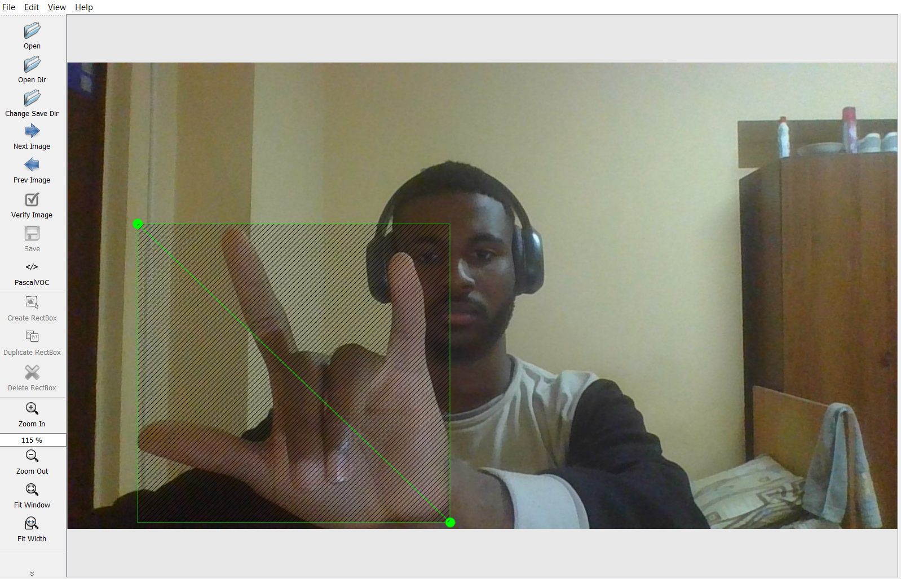
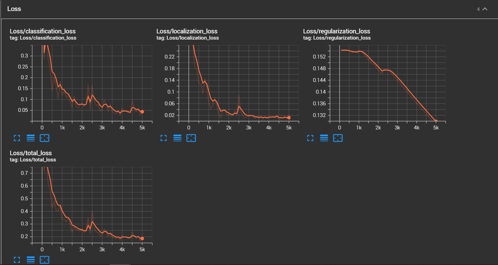

# Sign Language Detection and Caption

This project implements a real-time sign language detection system using a laptop's camera feed. The system detects and captions signs from a predefined set of labels, enhancing accessibility for communication.

The model is based on the **TensorFlow Object Detection API** and utilizes **SSD MobileNet V2** for transfer learning. The project involves annotating images, training the model, and detecting signs in real-time video input.

## Table of Contents

- [Overview](#overview)
- [Installation](#installation)
- [Dataset Annotation](#dataset-annotation)
- [Model Training](#model-training)
- [Real-time Detection](#real-time-detection)
- [Results](#results)
- [Conclusion](#conclusion)

## Overview

This project enables the detection of common signs in sign language:

- Hello
- Thanks
- Yes
- No
- I Love You

Once detected, the caption for the sign is displayed on the video feed. The system was trained using transfer learning with SSD MobileNet V2 from TensorFlow's Model Zoo.

## Installation

### Prerequisites

- Python 3.7+
- TensorFlow 2.10.1
- OpenCV
- Protobuf
- LabelImg (for annotation)

### Setup

1. Clone the repository and navigate to the project directory.

   ```bash
   git clone https://github.com/codeflamer/signlanguage_detection_caption.git
   cd signlanguage_detection_caption
   ```

2. Set up TensorFlow models:
   ```bash
   cd Tensorflow/models/research
   protoc object_detection/protos/*.proto --python_out=.
   python -m pip install .
   ```

## Dataset Annotation

Annotations were created using **LabelImg**, where bounding boxes were drawn around the hand signs in each image. These annotations were stored as XML files in the `annotations` directory.

Placeholder for image showcasing the annotation process:


## Model Training

The model used for training is **SSD MobileNet V2**. The training process used transfer learning to adapt the model to detect specific sign language gestures. The model configuration was updated to fit the new label set and trained for 1000 steps.

### Training Command

```python
python Tensorflow/models/research/object_detection/model_main_tf2.py     --model_dir=Tensorflow/workspace/models/ssd_mobilenet2     --pipeline_config_path=Tensorflow/workspace/models/ssd_mobilenet2/pipeline.config     --num_train_steps=1000
```

### Loss

Model performance was evaluated using TensorBoard, which tracks the loss of the model with every epoch.

TensorBoard screenshot:


## Real-time Detection

After training, the model is used for real-time detection through the laptop’s camera feed. The sign language gestures are identified, and the corresponding caption is displayed over the video. Captions are remembered for two lines before fading out.

### Detection Example


## Results

### Here are sample detections of the signs:

| Sign                                                                          | Detected Label | Confidence |
| ----------------------------------------------------------------------------- | -------------- | ---------- |
|             | Hello          | 95%        |
|           | Thanks         | 90%        |
|                 | Yes            | 92%        |
|                   | No             | 93%        |
|  | I Love You     | 89%        |

## Conclusion

This project demonstrates the use of transfer learning for creating a robust real-time sign language detection system. By using pre-trained models, the detection accuracy improves with minimal training time.
